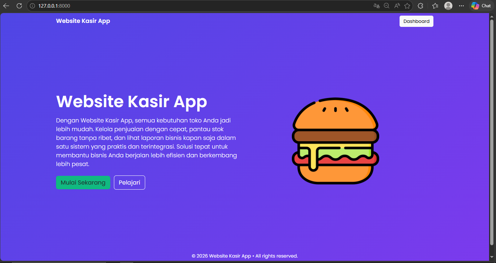
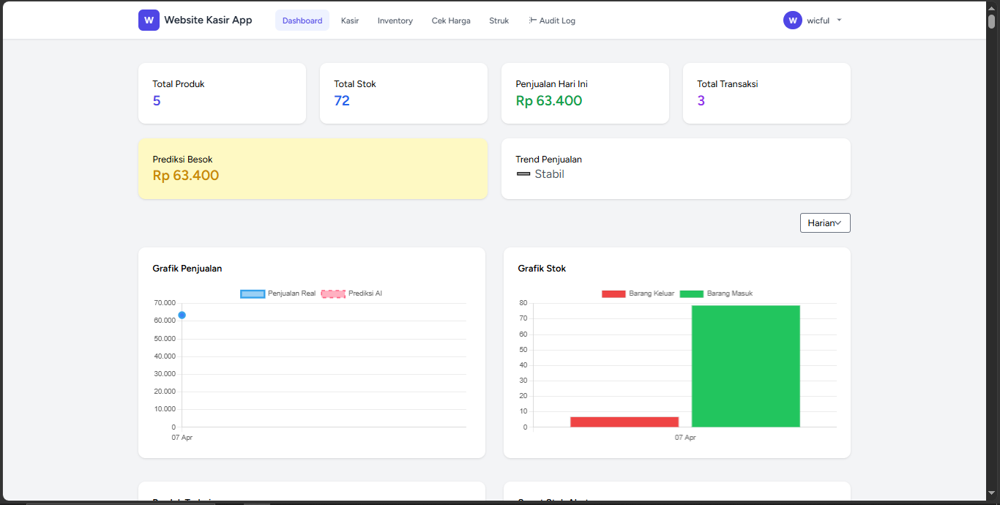

# 🛒 Website Kasir App

## 📌 Deskripsi
Website Kasir App adalah aplikasi kasir berbasis web yang dirancang untuk membantu pengelolaan toko secara **terintegrasi dalam satu sistem**. Aplikasi ini memungkinkan pengguna untuk mengelola penjualan, stok barang, transaksi, serta analisis bisnis dengan lebih efisien dan praktis.

Aplikasi ini **bukan berbasis multi-user dengan data terpisah**, melainkan **satu sistem terpusat** dimana semua user mengakses data yang sama. Sistem login hanya berfungsi sebagai **akses masuk (authentication)**, bukan pembeda data.

---

## 🚀 Fitur Utama

### 🔐 Sistem Autentikasi
- Register user
- Approval akun melalui email admin (Gmail)
- Login & logout
- Proteksi akses halaman

### 💰 Sistem Kasir (Transaksi)
- Scan barcode produk
- Input manual produk
- Perhitungan otomatis:
  - Total harga
  - Diskon
  - Kembalian
- Metode pembayaran:
  - 💵 Cash
  - 📱 QRIS (Midtrans)
  - 🏦 Transfer (Midtrans)

### 📺 Customer Display
- Tampilan khusus untuk pelanggan
- Menampilkan:
  - Daftar produk
  - Total pembayaran
  - Metode pembayaran
  - Kembalian
- Real-time sinkron dengan kasir

### 📦 Manajemen Inventory
- Tambah, edit, hapus produk
- Upload gambar produk
- Barcode produk
- Kategori produk
- Tracking:
  - Stok masuk
  - Stok keluar
  - Total stok

### 📊 Dashboard & Analitik
- Total produk
- Total stok
- Total transaksi
- Penjualan hari ini
- Grafik penjualan
- Grafik stok masuk & keluar

### 🤖 Smart System (AI Logic)
- Prediksi penjualan
- Trend penjualan (stabil/naik/turun)
- Rekomendasi restock otomatis
- Smart stock alert (peringatan stok habis)

### 🏪 Layout Rak Toko
- Konfigurasi:
  - Jumlah rak
  - Tingkat rak
  - Kapasitas rak
- Penempatan produk otomatis berdasarkan:
  - Produk terlaris
  - Minat pelanggan

### 🧾 Struk Transaksi
- Riwayat transaksi
- Detail invoice
- Metode pembayaran
- Waktu transaksi

### 📜 Audit Log
- Tracking semua aktivitas user:
  - Tambah produk
  - Update produk
  - Transaksi
- Status aktivitas (success, dll)

---

## ⚙️ Teknologi yang Digunakan

- **Backend:** Laravel  
- **Frontend:** Blade + Tailwind / Bootstrap  
- **Database:** MySQL  
- **Payment Gateway:** Midtrans  
- **Email Service:** Gmail SMTP  
- **Realtime Display:** JavaScript / WebSocket (opsional)

---

## 🔄 Alur Sistem

1. User register akun  
2. Admin approve via email  
3. User login ke sistem  
4. Kelola produk & stok  
5. Lakukan transaksi  
6. Data otomatis:
   - Masuk ke dashboard
   - Update stok
   - Tercatat di audit log  
7. Customer melihat melalui customer display  

---

## 📌 Catatan Penting

- Sistem ini **shared data (bukan multi-tenant)**  
- Semua user melihat data yang sama  
- Login hanya sebagai **akses sistem**  

---

## 🛠️ Instalasi

```bash
# Clone project
git clone https://github.com/username/kasir-app.git

# Masuk folder
cd kasir-app

# Install dependency
composer install

# Copy env
cp .env.example .env

# Generate key
php artisan key:generate

# Setting database di .env

# Migrasi database
php artisan migrate --seed

# Jalankan server
php artisan serve

# Jalankan queue (optional)
php artisan queue:work